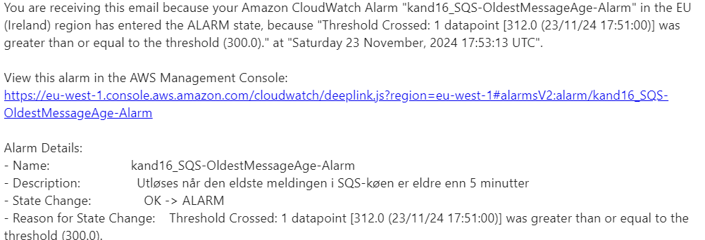
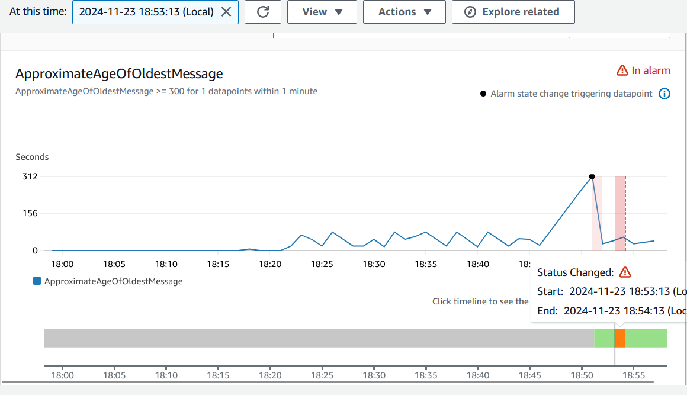

# PGR301-eksamen

## Oppgave 1:
  A: https://enkj3somp4.execute-api.eu-west-1.amazonaws.com/Prod/generate/
 ```
curl -X POST https://enkj3somp4.execute-api.eu-west-1.amazonaws.com/Prod/generate/ -H "Content-Type: application/json" -d '{"prompt": "A happy programmer"}'
 ```
  B:   Lenke til SAM-workflow https://github.com/Sanderchriss/eksamen-2024/actions/runs/12014401277/job/33490097811

## Oppgave 2:
   :
    Lenke til main (terraform apply) https://github.com/Sanderchriss/eksamen-2024/actions/runs/12014010586/job/33488814663 <br>
    Lenke til side-branch (terraform plan) https://github.com/Sanderchriss/eksamen-2024/actions/runs/12015505807/job/33493702826 <br>
    SQS-kø: https://sqs.eu-west-1.amazonaws.com/244530008913/lambda_sqs_queue_16 <br>
 ```   
curl -X POST https://enkj3somp4.execute-api.eu-west-1.amazonaws.com/Prod/generate/ -H "Content-Type: application/json" -d '{"prompt": "A happy programmer"}'
 ```

## Oppgave 3:
  Imaget på Docker bruker kun "latest" som tag, dette er gjort siden jeg ikke så et behov for å holde styr på forskjellige versjoner og deler, men ønsket fremdeles å vite at jeg hadde en oppdatert versjon av imaget.
  sado006/imagegenerator + https://sqs.eu-west-1.amazonaws.com/244530008913/lambda_sqs_queue_16

## Oppgave 4:
  Bilde av mottatt epost på grunn av alarmen
  
  
  Bilde av Cloudwatch under alarmen
  

## Oppgave 5:

 ### Automatisering og kontinuerlig levering (CI/CD)
En stor fordel med mikrotjenester er muligheten til å dele opp CI/CD. Hver mikrotjeneste kan ha sin egen pipeline, noe som gjør vedlikehold av tjenesten, testing, og utrulling av nye funksjoner enklere å styre. Dette gir teamene fleksibilitet og frihet i arbeidet sitt. Ulempen med dette er at versjonshåndtering ved utrulling kan bli komplisert, og man er avhengig av avanserte verktøy for å håndtere integrasjonstesting og funksjonalitet mellom tjenestene.
Ved bruk av serverless løsning vil komponentene være isolerte og uavhengige. Dette gjør at pipelines ofte kan være enkelt å sette opp for hver funksjon, og distribusjonen kan skje raskt og effektivt. En konsekvens er at antallet funksjoner i en serverless arkitektur kan bli høyt, noe som fører til mange pipelines å vedlikeholde, og økt kompleksitet mellom komponentene hvis de har avhengigheter.

### Observability (overvåkning)
Mikrotjenester er godt støttet av eksisterende verktøy som for eksempel Prometheus og Grafana når det gjelder overvåkning. Dette gjør det mulig å sentralisere logging og overvåkning for hver container. Feilsøking vil også være enklere så lenge man har god sporing/tracing som kan følge kommunikasjonen på tvers av tjenester. Ulempen er at feil i én tjeneste kan spre seg til andre, og sporing av komplekse feilkilder kan være uoversiktlig og tidkrevende.
Med serverless finnes det innebygde overvåkningstjenester som AWS CloudWatch, som gir rask tilgang til logging og metrikk for hver funksjon. Fordelen her er at skyleverandøren tilbyr gode standardverktøy. Ulempen er at overvåkning blir fragmentert når antallet funksjoner øker, og funksjonenes korte levetid gjør det vanskeligere å identifisere vedvarende problemer. I tillegg kan spesifikke utfordringer som "cold starts" være vanskelig å spore og løse.

### Skalerbarhet og kostnadskontroll
Mikrotjenester kan skalere hver tjeneste individuelt basert på behov. Dette gir en god kontroll over ressursbruken, men kostnadene kan være høye, særlig på grunn av kontinuerlig drift av containere, selv når de ikke er i bruk. Basekostnadene er også høyere enn ved en serverless-løsning.
I serverless arkitektur skalerer hver funksjon automatisk basert på etterspørsel. Dette gir en kostnadseffektivitet for applikasjoner med varierende trafikk, da man kun betaler for den faktiske bruken. En bakside er at kostnadene kan bli høye hvis trafikken er svært høy, eller hvis funksjonene er dårlig optimalisert for ujevnt tempo. 

### Eierskap og ansvar
I mikrotjenester har teamene full kontroll over hele livssyklusen til hver tjeneste. Dette inkluderer alt fra valg av rammeverk og infrastruktur til sikkerhetsoppdateringer. En ulempe er at teamene må håndtere mer operasjonelt ansvar, inkludert drift og ressursfordeling.
I en serverless arkitektur overføres mye av driftsansvaret til skyleverandøren. Dette reduserer teamets arbeidsmengde og ansvar for infrastruktur, men har ulempen at man har mindre kontroll over underliggende ressurser og må forholde seg til skyleverandørens begrensninger. Dette kan føre til utfordringer med å sikre optimal ytelse og kostnadskontroll.

### Oppsummering
Selv om Faas og mikrotjenester ofte blir ansett som like, er det forskjeller ved de. Hvilken løsning som passer til det enkelte prosjektet vil variere etter størrelse, bruk, og  ikke minst kompetanse, men det er også mulig å integrere de i hverandre. For eksempel kan man sette hver mikrotjeneste i en Function, for å gi en struktur som kan hjelpe ved skalerbarhet og kostnader.
